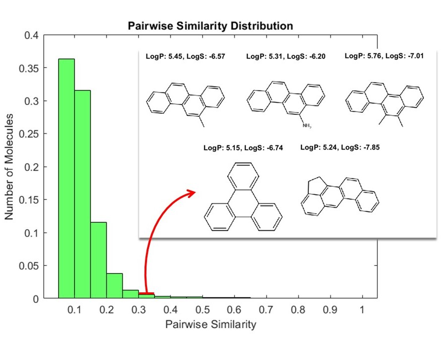

#  Molecular Similarity Analysis

Molecular similarity analysis is a powerful tool in cheminformatics and drug discovery, revealing that molecules with similar properties—such as high LogP and high LogS—can still be structurally diverse. This example guides you through importing molecular data, computing fingerprints, and visualizing similarity landscapes using [MATLAB&reg;](https://matlab.mathworks.com/) and [RDKit](https://www.rdkit.org/). 

By analyzing a dataset of molecules selected for both high LogP and LogS, you will discover that property-based filtering alone does not ensure structural similarity. Most molecules in the dataset are structurally dissimilar, highlighting the importance of combining both property- and structure-based approaches when exploring chemical space, designing libraries, or selecting leads. 

Embrace the diversity within chemical datasets and unlock deeper insights by integrating multiple analysis strategies!

This example uses data generated in the [Chemistry-Import-Visualize-and-Partition-Molecular-Datasets](https://github.com/mathworks/Chemistry-Import-Visualize-and-Partition-Molecular-Datasets/tree/main) repository. Be sure to check out that example as well for a comprehensive introduction to molecular dataset preparation.

## Setup 
To Run this example use this MATLAB Live Script: 
> Molecular_Similarity_Analysis.mlx  

### MathWorks Products (https://www.mathworks.com)

> [MATLAB](https://www.mathworks.com/products/matlab.html)

### 3rd Party Products:

> [Python&reg;](https://www.python.org/)

> [RDKit Open-Source Cheminformatics Software](https://www.rdkit.org/)

## Installation
Set up your Python environment by following the instructions provided in the guide found at [Python](https://www.python.org/) webpage. Make sure to give the python address and to check versions of Python compatible with MATLAB products by release. This allows to build proper [MATLAB Interface to Python](https://www.mathworks.com/support/requirements/python-compatibility.html). 

This example uses some of the functions from [RDKit](https://www.rdkit.org/). It can be installed easily by following its installation instructions on Linux, Windows, and macOS. You can install RDKit using _pip install rdkit_.

## Getting Started 
Follow the steps provided in this MATLAB Live Script:
> Molecular_Similarity_Analysis.mlx  

## Exercises
Try the exercises provided at the end of this example:

> **Similarity vs. Properties:** Pick two bins: one with low similarity scores and one with higher similarity scores. For each bin, note the range of LogP and LogS values for the molecules visualized. Are the LogP and LogS values more similar within the high-similarity bin, or is there still diversity in these properties? 

> **Diverse Structures Insight:** Why do you think molecules with similar LogP and LogS values can be structurally very different? Reflect on the types of molecular features that contribute to LogP and LogS, and discuss how different chemical structures might achieve similar property values?

## License
The license is available in the License.txt file in this GitHub repository.

The original dataset is generously provided by Professor Thierry Langer from the University of Vienna. 
The dataset has been made publicly available under CC BY 3.0 AT Attribution 3.0 Austria license in this publication: Molecules 2021, 26, 6185. See the "Dataset_*.rights" for details.

## Community Support
[MATLAB Central](https://www.mathworks.com/matlabcentral)

Copyright 2024 The MathWorks, Inc.

